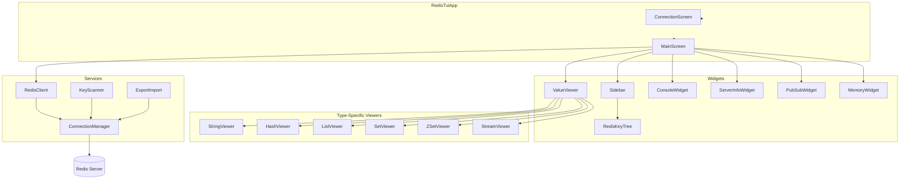
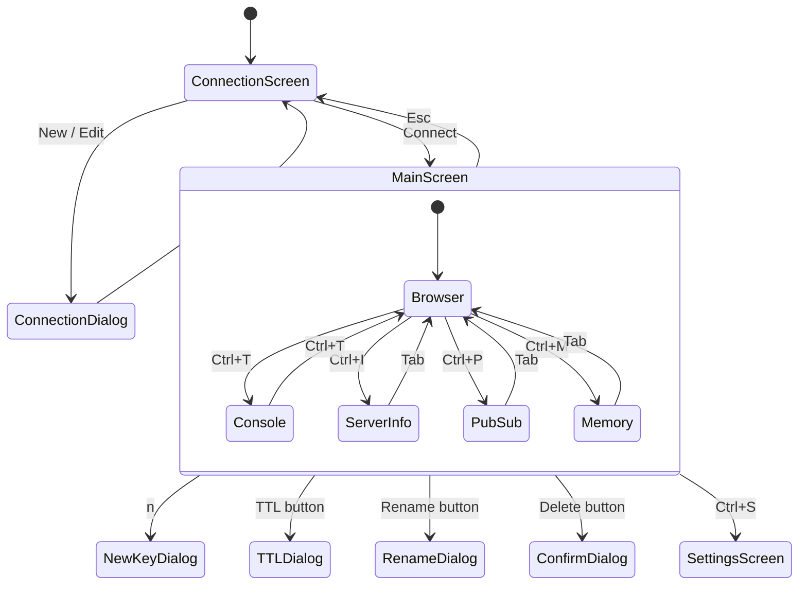
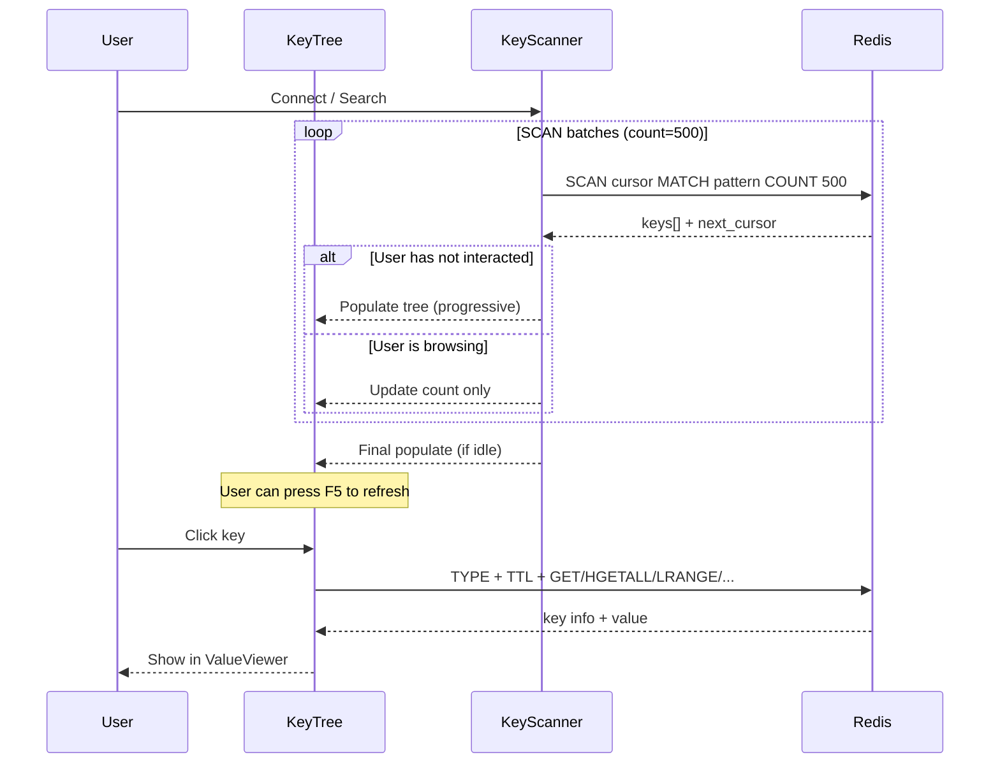

# Redis TUI


A feature-rich terminal UI client for Redis, built with [Textual](https://github.com/Textualize/textual) and [redis-py](https://github.com/redis/redis-py). Inspired by [Another Redis Desktop Manager](https://github.com/qishibo/AnotherRedisDesktopManager).

Manage your Redis instances directly from the terminal — browse keys, edit values, run commands, monitor the server, and more.

<!-- screenshot here: replace with actual screenshot/gif -->
<!--  -->

---

## Features

### Connection Management
- Save and manage multiple Redis connections
- Support for **Standalone**, **Cluster**, and **Sentinel** modes
- **SSH Tunnel** support (jump host)
- **SSL/TLS** connections
- ACL authentication (username + password, Redis 6+)
- Test connection before saving

### Key Browser
- Tree view with hierarchical grouping by `:` separator
- Progressive loading via `SCAN` — handles 800k+ keys without blocking
- Search/filter by pattern in real-time
- Database selector (db0-db15) with key counts per database
- Multi-select keys with `Space` for batch operations

### Value Viewers & Editors

| Type | Features |
|------|----------|
| **String** | Text / JSON (pretty-print) / HEX tabs, inline edit & save |
| **Hash** | DataTable with add/delete fields |
| **List** | DataTable with LPUSH / RPUSH / remove |
| **Set** | DataTable with add/remove members |
| **Sorted Set** | DataTable with member + score, add/remove |
| **Stream** | Read-only DataTable with dynamic field columns |

### Key Operations
- Create new keys (all types) with optional TTL
- Delete keys (single or batch) with confirmation
- Rename keys
- Edit TTL (set / remove / persist)
- Import/Export keys via `DUMP`/`RESTORE` (JSON format)

### Built-in Tools

| Tool | Description |
|------|-------------|
| **Console** | Redis CLI with command history and syntax-highlighted output |
| **Server Info** | Dashboard with Overview, Memory, Stats, Clients, Keyspace, Slow Log |
| **Pub/Sub** | Subscribe to channels with live message log |
| **Memory Analysis** | Per-key memory usage analysis with sorting |
| **Settings** | Key separator, SCAN batch size, theme, and more |

---

## Architecture

### Component Overview



### Screen Navigation



### Progressive Key Loading

The key browser uses `SCAN` with progressive rendering to handle large databases (800k+ keys) without freezing the UI:



---

## Requirements

- **Python 3.11+**
- A running Redis instance (local or remote)

---

## Installation

### With pipx (recommended)

[pipx](https://pipx.pypa.io/) installs the CLI globally and handles PATH automatically:

```bash
pipx install git+https://github.com/alissonviana/redis-tui.git
```

### With pip

```bash
pip install git+https://github.com/alissonviana/redis-tui.git
```

> **Windows note:** If `redis-tui` is not recognized after install, pip may have installed it to a directory not in your PATH. Use `python -m redis_tui` instead, or add Python's `Scripts` folder to your PATH:
> ```powershell
> # Find where pip installs scripts:
> python -c "import sysconfig; print(sysconfig.get_path('scripts'))"
> # Add that path to your system PATH
> ```

### From source (development)

```bash
git clone https://github.com/alissonviana/redis-tui.git
cd redis-tui
pip install -e .
```

---

## Usage

```bash
redis-tui
```

or (works everywhere, no PATH needed):

```bash
python -m redis_tui
```

---

## Keyboard Shortcuts

### Global

| Key | Action |
|-----|--------|
| `q` | Quit |
| `F1` | Help |

### Main Screen

| Key | Action |
|-----|--------|
| `F5` | Refresh keys |
| `Esc` | Back to connections |
| `n` | New key |
| `Space` | Toggle key selection (batch) |
| `Ctrl+D` | Toggle dark / light theme |
| `Ctrl+T` | Console tab |
| `Ctrl+I` | Server Info tab |
| `Ctrl+P` | Pub/Sub tab |
| `Ctrl+M` | Memory Analysis tab |
| `Ctrl+S` | Settings |

---

## Project Structure

```
src/redis_tui/
├── app.py                    # Main Textual application
├── constants.py              # App-wide constants
├── models/
│   ├── connection.py         # ConnectionConfig, ConnectionMode
│   ├── key_info.py           # KeyInfo, KeyType, TreeNodeData
│   └── settings.py           # AppSettings
├── services/
│   ├── config_store.py       # Connection persistence
│   ├── settings_store.py     # Settings persistence
│   ├── connection_manager.py # Redis client lifecycle + SSH tunnel
│   ├── redis_client.py       # High-level async Redis wrapper
│   ├── key_scanner.py        # SCAN-based async key iterator
│   ├── tree_builder.py       # Key hierarchy builder
│   └── export_import.py      # DUMP/RESTORE import-export
├── screens/
│   ├── connection_screen.py  # Connection list
│   ├── connection_dialog.py  # Add/edit connection modal
│   ├── main_screen.py        # Main browser screen
│   ├── confirm_dialog.py     # Confirmation modal
│   ├── new_key_dialog.py     # Create key modal
│   ├── ttl_dialog.py         # Edit TTL modal
│   ├── rename_dialog.py      # Rename key modal
│   └── settings_screen.py    # Settings modal
├── widgets/
│   ├── sidebar.py            # DB selector + search + key tree
│   ├── key_tree.py           # Tree with multi-select support
│   ├── key_header.py         # Key info bar + action buttons
│   ├── value_viewer.py       # Type-aware viewer switcher
│   ├── string_viewer.py      # String editor (Text/JSON/HEX)
│   ├── hash_viewer.py        # Hash field editor
│   ├── list_viewer.py        # List element editor
│   ├── set_viewer.py         # Set member editor
│   ├── zset_viewer.py        # Sorted set editor
│   ├── stream_viewer.py      # Stream entry viewer
│   ├── console_widget.py     # Redis CLI console
│   ├── server_info_widget.py # Server info dashboard
│   ├── pubsub_widget.py      # Pub/Sub viewer
│   └── memory_widget.py      # Memory analysis
└── styles/
    └── app.tcss              # Dark/light theme styles
```

---

## Configuration

All settings and saved connections are stored in `~/.redis-tui/`:

```
~/.redis-tui/
├── connections.json   # Saved Redis connections
└── settings.json      # App preferences
```

| Setting | Default | Description |
|---------|---------|-------------|
| `key_separator` | `:` | Delimiter for key tree grouping |
| `scan_count` | `100` | Keys per SCAN batch |
| `auto_refresh_interval` | `0` (off) | Auto-refresh in seconds |
| `theme` | `dark` | `dark` or `light` |
| `max_keys_display` | `10000` | Max keys to load |

---

## Dependencies

| Package | Purpose |
|---------|---------|
| [textual](https://github.com/Textualize/textual) | TUI framework |
| [redis-py](https://github.com/redis/redis-py) | Async Redis client with hiredis acceleration |
| [sshtunnel](https://github.com/pahaz/sshtunnel) | SSH tunnel support |

---

## Contributing

Contributions are welcome! Feel free to open issues or pull requests.

1. Fork the repository
2. Create a feature branch: `git checkout -b feature/my-feature`
3. Commit your changes: `git commit -m "Add my feature"`
4. Push: `git push origin feature/my-feature`
5. Open a Pull Request

---

## License

MIT License — see [LICENSE](LICENSE) for details.
